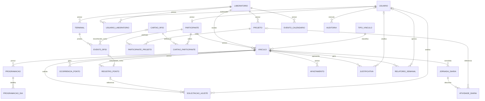

# ERD — CheckPonto

O diagrama abaixo utiliza Mermaid e pode ser renderizado pelo GitHub.

## Observação

Este ERD representa o modelo lógico inicial. A migration SQL será criada na
etapa seguinte, após a validação deste modelo.
